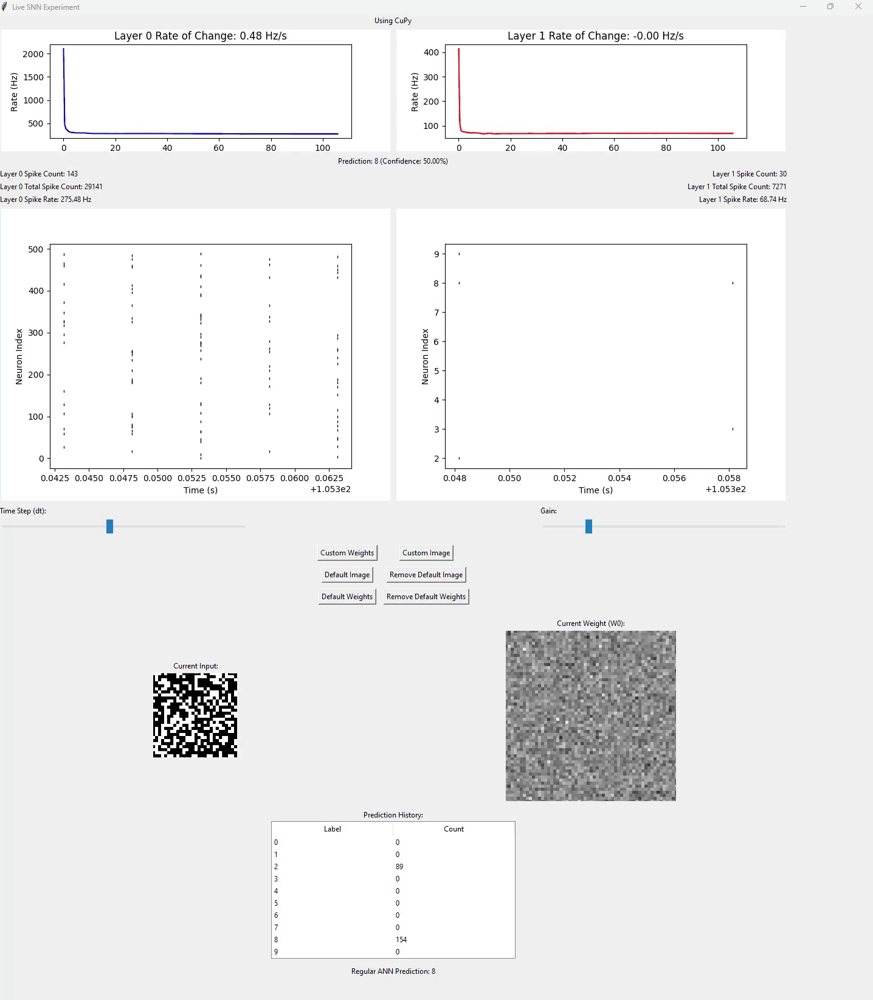
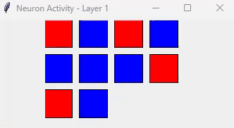

# Spiking Neural Network (SNN) Application

## Introduction
The **Spiking Neural Network (SNN) Application** is a Python-based tool designed for simulating and analyzing spiking neural networks. It provides a comprehensive GUI for loading weights, visualizing neuron activity, and monitoring network performance in real-time.

## Features
- **Real-time Visualization:** Monitor neuron activity across layers with dynamic visual feedback.
- **Weight Management:** Load, save, and manage network weights seamlessly.
- **Image Processing:** Load and process images to serve as input for the SNN.
- **Performance Monitoring:** Track spike rates, computation times, and memory usage.
- **Adaptive Learning:** Implements adaptive learning rates and homeostatic plasticity mechanisms.
- **Export Visualizations:** Generate interactive HTML visualizations of the network.
- **Debug Terminal:** Integrated debug terminal within the GUI for real-time error tracking.

## Live Decoding in Action




## Installation
### Prerequisites
- Python 3.7 or higher
- [NumPy](https://numpy.org/)
- [CuPy](https://cupy.dev/) *(optional, for GPU acceleration)*
- [Tkinter](https://docs.python.org/3/library/tkinter.html)
- [Matplotlib](https://matplotlib.org/)
- [Pillow](https://python-pillow.org/)
- [SciPy](https://www.scipy.org/)
- [Plotly](https://plotly.com/)

### Setup
1. **Clone the repository:**
    ```bash
    git clone https://github.com/yourusername/Nur_Spikes.git
    cd Nur_Spikes
    ```

2. **Create a virtual environment:**
    ```bash
    python -m venv xtpenv
    ```

3. **Activate the virtual environment:**
    - On Windows:
        ```bash
        xtpenv\Scripts\activate
        ```
    - On Unix or MacOS:
        ```bash
        source xtpenv/bin/activate
        ```

4. **Install dependencies:**
    ```bash
    pip install -r requirements.txt
    ```

## Usage
1. **Run the application:**
    ```bash
    python decoder.py
    ```

2. **Load Weights:**
    - Click on the "Custom Weights" button to load existing `.npz` weight files.

3. **Load Image:**
    - Click on the "Custom Image" button to load an image that will serve as input to the network.

4. **Default Options:**
    - Use "Default Image" and "Default Weights" buttons to load predefined configurations.

5. **Optimize Weights:**
    - Click on "Optimize Weights" to initiate the optimization process.

6. **Export Visualization:**
    - Use the "Export Visualization" button to save interactive network visualizations.

7. **Debug Terminal:**
    - View real-time logs and error messages in the integrated debug terminal.

## Contributing
Contributions are welcome! Please open an issue or submit a pull request for any enhancements or bug fixes.

## License
This project is licensed under the MIT License. See the [LICENSE](LICENSE) file for details.

## Acknowledgments
- Inspired by spiking neural network research.
- Thanks to the open-source community for providing essential libraries.
````

