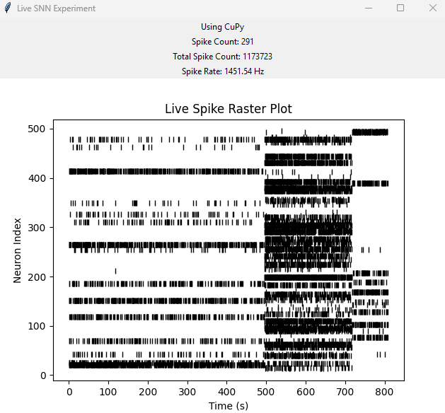

# Neural Decoding Experiment Script

This sophisticated script simulates neural decoding experiments, providing a robust framework for investigating how populations of neurons represent and decode visual information. By leveraging diverse image datasets and adjustable parameters, this tool facilitates exploration of the neural code and enhances comprehension of brain information processing.

## Key Features

<details>
  <summary>Dataset Versatility</summary>

*   **Seamless Integration:** Effortlessly incorporates MNIST and CIFAR-10 datasets, including automated download and extraction, ensuring convenient access to widely used benchmark datasets.
*   **Custom Dataset Flexibility:** Offers the flexibility to incorporate custom datasets by providing image files and corresponding labels, enabling researchers to explore diverse datasets and research questions.
</details>

<details>
  <summary>Granular Parameter Control</summary>

*   **Fine-grained Control:** Provides precise control over critical simulation parameters, including time step (`dt`), neuron gain (`gain`), and number of repetitions (`nrep`), allowing for detailed manipulation of the simulation environment.
*   **Systematic Exploration:** Enables systematic parameter exploration to test various combinations and optimize decoding accuracy, facilitating a comprehensive understanding of parameter influences.
</details>

<details>
  <summary>Multifaceted Spike Visualization</summary>

*   **Raster plots:** Visualize spike trains of individual neurons over time, revealing temporal patterns and dynamics of neural activity.
*   **Histograms:** Analyze the distribution of spike counts across neurons, providing insights into population activity and response variability.
*   **Rate plots:** Visualize average spike rates over time, capturing the overall firing patterns of neuron populations and their temporal evolution.
*   **Heatmaps:** Visualize spike activity patterns across neurons and images, highlighting correlations and dependencies between neural responses and visual stimuli.
</details>

<details>
  <summary>Comprehensive Decoding Analysis</summary>

*   **Confusion matrix:** Evaluate the accuracy of image classification based on neural activity, quantifying decoding performance and identifying potential biases.
*   **Posterior-averaged images:** Visualize the decoded representation of images, providing a visual assessment of the decoded information and its fidelity to the original stimulus.
</details>

<details>
  <summary>User-Friendly Command-line Interface</summary>

*   **Intuitive CLI:** Offers an intuitive command-line interface (CLI) for effortlessly configuring datasets, data directories, spike visualization formats, and parameter files, simplifying experiment setup and execution.
</details>

<details>
  <summary>Real-time Live Decoding</summary>

*   **Dynamic Observation:** Conduct live decoding experiments with continuous input and real-time spike visualization, enabling dynamic observation of neural activity and its response to ongoing stimuli.
</details>

<details>
  <summary>Custom Input Activation</summary>

*   **Targeted Investigations:** Activate the neural population with custom input and visualize spike activity in real-time, facilitating targeted investigations of specific neural responses and encoding mechanisms.
</details>

<details>
  <summary>Extensible and Modular Codebase</summary>

*   **Adaptable Framework:** Features a modular design and comprehensive documentation to facilitate effortless extension and modification for specific research requirements, promoting code reusability and adaptability.
</details>


## Live Decoding in Action



<details>
  <summary>Delving into the Neuroscience Underlying the Raster Plot</summary>

This raster plot serves as a visual representation of the spiking activity exhibited by a population of neurons responding to diverse stimuli in a live decoding experiment. Each row corresponds to an individual neuron, while each dot signifies an action potential (spike). The horizontal axis represents time, and the vertical axis represents the neuron index. Observe the distinct firing patterns displayed by different neurons in response to varying stimuli, reflecting their unique selectivity and encoding properties. This dynamic visualization of neural activity is paramount for comprehending how the brain processes information in real-time.

**Neural Encoding and Decoding:**

*   **Encoding:** The intricate process by which neurons transform external stimuli, such as images, sounds, or touch, into a language of electrical activity. This involves converting sensory input into a code that the brain can decipher, primarily based on the timing and frequency of spikes generated by neurons. Different stimuli elicit distinct spiking patterns within the neural population, creating a neural representation of the sensory world.

*   **Decoding:** The brain's remarkable capacity to interpret these complex spike patterns and reconstruct the original stimulus or extract meaningful information. This involves analyzing the activity of numerous neurons and deciphering the underlying message conveyed by their collective firing patterns. Decoding can be conceptualized as the reverse process of encoding, where the brain extracts meaning from the neural code.

**Raster Plots and Neural Activity:**

*   **Visualizing Temporal Dynamics:** Raster plots offer an invaluable tool for visualizing the temporal dynamics of neural activity. They enable researchers to observe how neurons fire over time and identify patterns in their spiking behavior. The precise timing of spikes is crucial for information processing in the brain, as it can convey critical information about the onset, duration, and intensity of a stimulus.

*   **Representing Neural Codes:** The frequency of spikes, or firing rate, constitutes another pivotal aspect of the neural code. Different neurons may exhibit varying baseline firing rates and respond to stimuli with increases or decreases in their firing rate. Raster plots facilitate the visualization of these changes in firing rate, providing insights into how neural populations encode and process information.

*   **Analyzing Selectivity and Tuning:** Individual neurons may exhibit selectivity to specific features of a stimulus. For instance, in the visual system, certain neurons may respond selectively to edges, while others may respond to motion or color. Raster plots can unveil these selectivities by revealing which neurons are activated by particular stimuli or stimulus features.

**Live Decoding and its Profound Implications:**

*   **Real-time Observation:** Live decoding experiments empower researchers to observe and analyze neural activity in real-time as stimuli are presented, allowing for the investigation of dynamic neural processes and their evolution over time. By observing how neural activity changes in response to different stimuli, researchers can gain deeper insights into the neural code and the mechanisms underlying perception, cognition, and behavior.

*   **Brain-Computer Interfaces:** Live decoding holds tremendous promise for developing brain-computer interfaces (BCIs), which aim to establish a direct communication pathway between the brain and external devices, such as computers or prosthetic limbs. By decoding neural activity in real-time, BCIs can translate thoughts and intentions into actions, enabling individuals to control devices with their minds. This technology has the potential to revolutionize assistive technology and restore lost function to individuals with paralysis or other disabilities.

*   **Advancements in Neuroscience:** Live decoding experiments contribute significantly to our understanding of how the brain represents and processes information. By analyzing neural activity in real-time, researchers can gain invaluable insights into the neural code and the mechanisms underlying various cognitive functions, such as perception, attention, decision-making, and learning. This knowledge can lead to breakthroughs in treating neurological disorders and developing novel therapies for brain injury and disease.
  [⬆️ Back to Top](#live-decoding-with-different-inputs) 

</details>


## Getting Started

### Usage

To execute the script, use the following command:

```bash
python decoder.py [arguments]
```

### Arguments

*   `--dataset`: Specifies the dataset to use. Options include:
    *   `mnist`: Downloads and utilizes the MNIST dataset.
    *   `cifar10`: Downloads and utilizes the CIFAR-10 dataset.
    *   `other`: Utilizes a custom dataset (requires implementing loading logic in the code). Default: `mnist`.
*   `--data_dir`: Specifies the directory for storing downloaded data. Default: `data`.
*   `--spike_format`: Specifies the format for visualizing spike activity. Options include: `raster`, `histogram`, `rate`, `heatmap`. Default: `raster`.
*   `--params_file`: Specifies the JSON file containing experiment parameters. Default: `params.json`.
*   `--interactive`, `-i`: Run in interactive mode.
*   `--live`, `-l`: Run in live mode with a GUI for image input.
*   `--activate`, `-a`: Activate the neural population with custom input.

### Example Commands

To run the script with the MNIST dataset and raster plots:

```bash
python decoder.py --dataset mnist --spike_format raster
```

To run the script with the CIFAR-10 dataset and histograms:

```bash
python decoder.py --dataset cifar10 --spike_format histogram
```

To run the script with a custom dataset:

```bash
python decoder.py --dataset other --data_dir my_data --params_file my_params.json
```

## Configuration

### Configuration File (`params.json`)

The `params.json` file houses the parameters for the experiments. Here's an example:

```json
{
  "parameters": {
    "dt": 0.01,
    "gain": 1.0,
    "nrep": 5
  },
  "dts": [0.005, 0.01],
  "gains": [0.8, 1.2],
  "nreps": [1, 2]
}
```

*   `parameters`: Default values for the simulation time step (`dt`), neuron gain (`gain`), and number of repetitions (`nrep`).
*   `dts`, `gains`, `nreps`: Lists of values for testing each parameter.


## Output

The script generates the following outputs:

*   Spike activity visualizations: Raster plots, histograms, rate plots, or heatmaps, displayed during the experiment.
*   Confusion matrices: Saved as PNG images in the `figures` directory.
*   Posterior-averaged images: Displayed after each experiment.


## Requirements

*   Python 3.6 or higher
*   NumPy
*   SciPy
*   Matplotlib
*   Pillow (PIL)
*   Requests

To install the necessary packages, run:

```bash
pip install numpy scipy matplotlib pillow requests
```

## Contributing

Contributions are welcome! If you identify any issues or have suggestions for improvement, please feel free to open an issue or submit a pull request on the GitHub repository.

## License

This project is licensed under the MIT License - see the LICENSE file for details.

